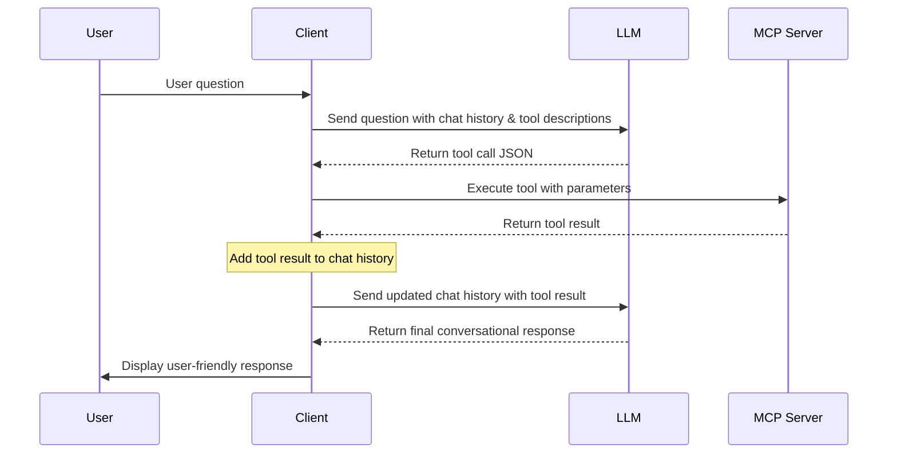

# TypeScript MCP Client

A TypeScript-based Model Context Protocol (MCP) client for testing MCP servers, with support for multiple LLM providers and LLM tool calling capabilities.

## Features

- Support for multiple LLM providers (Ollama, OpenAI, OpenRouter, Deepseek)
- Support for MCP servers (default: mcp_k8s_server)
- LLM tool calling through MCP servers
- Configurable via JSON config file or environment variables
- Interactive console interface for testing

## Installation

```bash
# Install dependencies
npm install

# Build the project
npm run build

# Make the CLI executable
chmod +x ./dist/index.js
```

## Usage

```bash
# Run with default configuration
npm start

# Run with custom configuration file
npm start -- ./config.json
```

## Configuration

You can configure the client using a JSON file or environment variables.

### Config File Examples

#### Basic Configuration

```json
{
  "llm": {
    "provider": "ollama",
    "baseUrl": "http://localhost:11434",
    "model": "llama3",
    "temperature": 0.7,
    "maxTokens": 1000
  },
  "mcpServers": {
    "k8s": {
      "name": "mcp_k8s_server",
      "command": "mcp_k8s_server",
      "enabled": true
    },
    "custom": {
      "name": "custom_mcp_server",
      "command": "custom_mcp_server",
      "enabled": false
    }
  },
  "defaultMCPServer": "k8s"
}
```

#### MCP Server Configuration Examples

##### Local MCP Server
```json
{
  "mcpServers": {
    "local": {
      "name": "local_mcp_server",
      "command": "mcp_server",
      "args": ["--option1", "--option2"],
      "enabled": true
    }
  }
}
```

##### Remote MCP Server
```json
{
  "mcpServers": {
    "remote": {
      "name": "remote_mcp_server",
      "baseUrl": "http://192.168.182.128:8000",
      "enabled": true
    }
  }
}
```

##### Multiple MCP Servers
```json
{
  "mcpServers": {
    "k8s": {
      "name": "mcp_k8s_server",
      "baseUrl": "http://192.168.182.128:8000",
      "enabled": true
    },
    "custom": {
      "name": "custom_mcp_server",
      "baseUrl": "http://192.168.1.100:9000",
      "enabled": false
    }
  },
  "defaultMCPServer": "k8s"
}
```

#### LLM Provider Configuration Examples

##### Ollama (Local)
```json
{
  "llm": {
    "provider": "ollama",
    "baseUrl": "http://localhost:11434",
    "model": "llama3",
    "temperature": 0.7,
    "maxTokens": 1000
  }
}
```
Note: Ollama typically doesn't require an API key when running locally.

##### OpenAI
```json
{
  "llm": {
    "provider": "openai",
    "apiKey": "sk-your-openai-key-here",
    "model": "gpt-3.5-turbo",
    "temperature": 0.7,
    "maxTokens": 1000
  }
}
```

##### OpenRouter
```json
{
  "llm": {
    "provider": "openrouter",
    "apiKey": "your-openrouter-key-here",
    "baseUrl": "https://openrouter.ai/api/v1",
    "model": "anthropic/claude-3-opus",
    "temperature": 0.7,
    "maxTokens": 1000
  }
}
```

##### Deepseek
```json
{
  "llm": {
    "provider": "deepseek",
    "apiKey": "your-deepseek-key-here",
    "baseUrl": "https://api.deepseek.com/v1",
    "model": "deepseek-chat",
    "temperature": 0.7,
    "maxTokens": 1000
  }
}
```

### Environment Variables

- `LLM_PROVIDER`: The LLM provider to use (ollama, openai, openrouter, deepseek)
- `LLM_API_KEY`: API key for the LLM provider
- `LLM_BASE_URL`: Base URL for the LLM provider's API
- `LLM_MODEL`: Model to use for the LLM
- `LLM_TEMPERATURE`: Temperature setting for the LLM
- `LLM_MAX_TOKENS`: Maximum tokens to generate
- `DEFAULT_MCP_SERVER`: Default MCP server to use

## Available Commands

Once the client is running, you can use the following commands:

### Basic Commands

- `help`: Show available commands
  ```
  > help
  ```

- `exit` or `quit`: Exit the application
  ```
  > exit
  ```

### Server Management

- `servers`: List available MCP servers
  ```
  > servers
  
  Available MCP Servers:
  ---------------------
  * 1. mcp_k8s_server (Enabled)
    2. custom_mcp_server (Disabled)
  ```

- `use <server-key>`: Set the active MCP server
  ```
  > use k8s
  Active MCP server set to: mcp_k8s_server
  ```

- `enable <server>`: Enable an MCP server
  ```
  > enable custom
  Server 'custom_mcp_server' enabled.
  ```

- `disable <server>`: Disable an MCP server
  ```
  > disable custom
  Server 'custom_mcp_server' disabled.
  ```

### Tool and Resource Interaction

- `tools`: List tools for the active MCP server
  ```
  > tools
  
  Tools for mcp_k8s_server:
  -------------------------
  1. get_pods
     Description: Get all pods in the namespace
  
  2. get_pod_logs
     Description: Get logs for a specific pod
  ```

- `resources`: List resources for the active MCP server
  ```
  > resources
  
  Resources for mcp_k8s_server:
  -------------------------
  1. k8s://namespaces
     Name: Kubernetes Namespaces
     Description: List of all namespaces in the cluster
  ```

- `call <tool> <args>`: Call a tool with JSON arguments
  ```
  > call get_pods {"namespace": "default"}
  
  Tool Result:
  ------------
  {
    "content": [
      {
        "type": "text",
        "text": "[{\"name\":\"nginx-pod\",\"namespace\":\"default\",\"status\":\"Running\"}]"
      }
    ]
  }
  ```

- `resource <uri>`: Read a resource from the active MCP server
  ```
  > resource k8s://namespaces
  
  Resource Content:
  -----------------
  {
    "contents": [
      {
        "uri": "k8s://namespaces",
        "text": "[\"default\", \"kube-system\", \"kube-public\"]"
      }
    ]
  }
  ```

### Chat and Configuration

- `clear`: Clear chat history
  ```
  > clear
  Chat history cleared.
  ```

- `config`: Show current configuration
  ```
  > config
  
  Current Configuration:
  ---------------------
  {
    "llm": {
      "provider": "openai",
      "baseUrl": "https://api.openai.com/v1",
      "model": "gpt-3.5-turbo",
      "temperature": 0.7,
      "maxTokens": 1000
    },
    "mcpServers": {
      "k8s": {
        "name": "mcp_k8s_server",
        "baseUrl": "http://192.168.182.128:8000/sse",
        "enabled": true
      }
    },
    "defaultMCPServer": "k8s"
  }
  ```

### Chat Examples

You can also send any message to chat with the LLM:

```
> What pods are running in the default namespace?

LLM wants to use tool: get_pods
Arguments: {
  "namespace": "default"
}

Tool result: {
  "content": [
    {
      "type": "text",
      "text": "[{\"name\":\"nginx-pod\",\"namespace\":\"default\",\"status\":\"Running\"}]"
    }
  ]
}

LLM: I found 1 pod running in the default namespace:
- nginx-pod (Status: Running)
```

```
> Tell me a joke about programming.

LLM: Why do programmers prefer dark mode?

Because light attracts bugs!
```

## LLM Tool Calling

The client now supports LLM tool calling, allowing the LLM to:
1. Learn about available tools from MCP servers
2. Decide when to use tools based on user queries
3. Return a JSON tool call when needed
4. Process tool results and provide a conversational response

### How Tool Calling Works

1. When you send a message to an LLM with tools available:
   - The system prompt includes detailed tool descriptions
   - The LLM can choose to answer directly or call a tool

2. If the LLM decides to call a tool, it will respond with a JSON object:
   ```json
   {
     "tool": "tool-name",
     "arguments": {
       "argument-name": "value"
     }
   }
   ```

3. The client will:
   - Parse this response and recognize it as a tool call
   - Execute the tool with the provided arguments
   - Add the tool result to the conversation history
   - Send the complete conversation history (including the tool result) back to the LLM
   - Get a natural, conversational response that incorporates the tool result
   - Display this final response to the user

### Detailed Tool Calling Workflow

The tool calling workflow follows these steps:



This ensures the LLM has full context when generating its final response, resulting in more natural and helpful answers that properly incorporate the tool information.

### Example Tool Calling Session

```
MCP Client started.
LLM provider: openai
Active MCP server: mcp_k8s_server
Loaded 3 tools for LLM to use.

Type "help" for available commands.
> What pods are running in the default namespace?

LLM wants to use tool: get_pods
Arguments: {
  "namespace": "default"
}

Tool result: {
  "content": [
    {
      "type": "text",
      "text": "[{\"name\":\"nginx-pod\",\"namespace\":\"default\",\"status\":\"Running\"}]"
    }
  ]
}

LLM: I found 1 pod running in the default namespace:
- nginx-pod (Status: Running)

> servers

Available MCP Servers:
---------------------
* 1. mcp_k8s_server (Enabled)
  2. custom_mcp_server (Disabled)

> exit
```

## License

MIT
